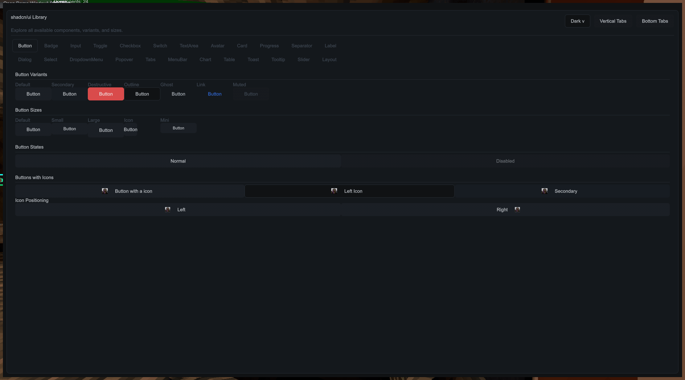
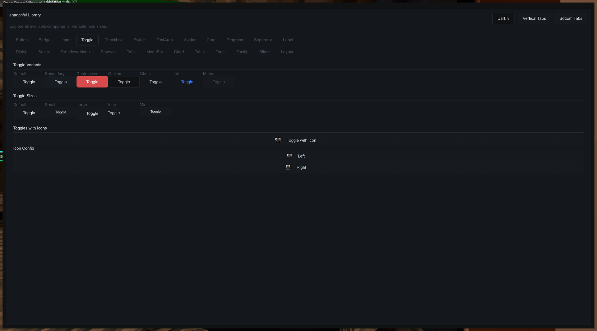
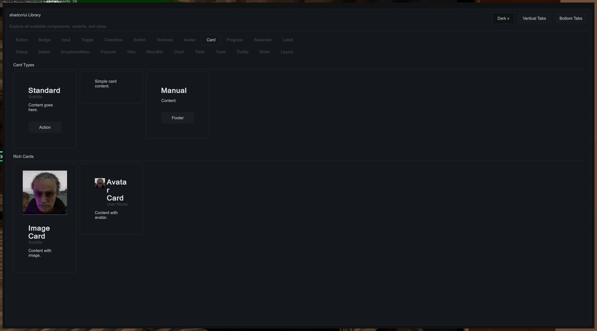
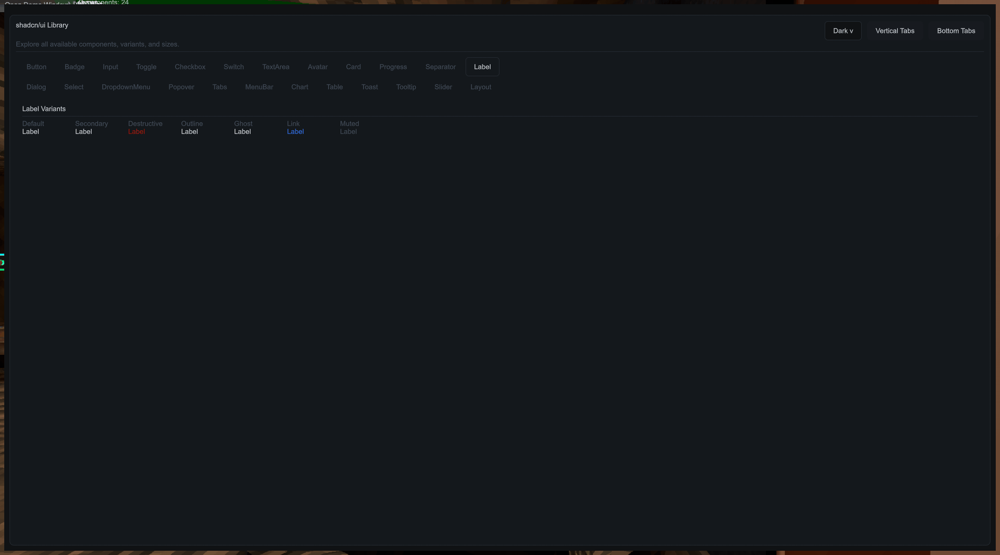
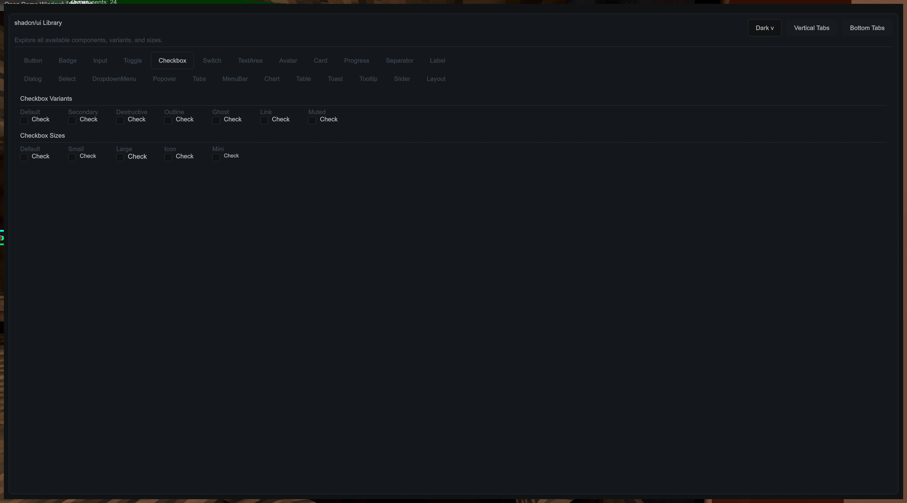

# shadcnui

A C# UI component library inspired by shadcn/ui. Provides reusable, customizable components for .NET applications using Unity's IMGUI system.

## Installation

Clone the repo and open the solution in Visual Studio:

```bash
git clone https://github.com/official-notfishvr/shadcn-ui.git
cd shadcnui
```

Then open `shadcnui.slnx` and build the project. You'll find `shadcnui.dll` in `src/ShadcnUi/bin/<Configuration>/`.

Add it as a reference to your C# project.

## Repository layout

The runtime library is in `src/ShadcnUi`. Its public `shadcnui.GUIComponents.*` namespaces stay unchanged.

The Unity demo plugin and standalone BepInEx examples are in `samples`. Both sample projects are included in `shadcnui.slnx`. Unity reference assemblies stay in `References`, documentation stays in `docs`, and shared MSBuild settings live in the root `Directory.Build.props`.

## Usage

```csharp
using shadcnui.GUIComponents.Core.Base;
using shadcnui.GUIComponents.Core.Styling;
using UnityEngine;

public class ExampleUI : MonoBehaviour
{
    private GUIHelper _gui;
    private Rect _windowRect = new Rect(20, 20, 400, 500);
    private bool _showWindow = true;

    void Start()
    {
        _gui = new GUIHelper();
    }

    void OnGUI()
    {
        if (_showWindow)
            _windowRect = GUI.Window(0, _windowRect, DrawWindow, "UI Demo");

        _gui.DrawOverlays(); // required for dialogs, popovers, toasts, tooltips
    }

    void DrawWindow(int id)
    {
        _gui.UpdateGUI(_showWindow);
        if (!_gui.BeginGUI())
            return;

        _gui.BeginVerticalGroup();

        _gui.Heading("Buttons");
        _gui.Button("Default");
        _gui.Button("Destructive", ControlVariant.Destructive);
        _gui.Button("Secondary", ControlVariant.Secondary);

        _gui.EndVerticalGroup();
        _gui.EndGUI();
        GUI.DragWindow();
    }
}
```

## Components

Buttons, cards, inputs, badges, toggles, tables, dialogs, tabs, and more.

### Buttons

Builder-style and direct calls both work:

```csharp
_gui.Button("Default");
_gui.Button("Secondary").Secondary();
_gui.Button("Outline").Outline();
_gui.Button("Danger").Destructive();
_gui.Button("Small", ControlVariant.Default, ControlSize.Small);
_gui.Button("Large", ControlVariant.Default, ControlSize.Large);
```

### Cards

Use the fluent builder — `.Render()` is required for void builders:

```csharp
_gui.Card().Title("Relay Tower").Subtitle("North Wing").Content("All systems nominal").Size(220f, 200f).Render();
_gui.Card().Title("Operator").Content("A compact card.").Avatar(avatarTexture).Size(220f, 170f).Render();
```

For fully custom card layouts use the `BeginCard` / `EndCard` helpers:

```csharp
_gui.BeginCard(220f, 180f);
_gui.CardHeader(() => _gui.Heading("Title"));
_gui.CardContent(() => _gui.Label("Content").Muted());
_gui.CardFooter(() => _gui.Button("Action", ControlVariant.Outline, ControlSize.Small));
_gui.EndCard();
```

### Inputs

```csharp
// Text input with label and placeholder
_name = _gui.Input(_name).Label("Name").Placeholder("Enter name");

// Password field
_password = _gui.Input(_password).Label("Password").Password();

// Multi-line text area
_notes = _gui.TextArea(_notes).Label("Notes").MinHeight(110f).ShowCharacterCount();
```

### Badges

```csharp
_gui.Badge("Default").Render();
_gui.Badge("Queued").Secondary().Render();
_gui.Badge("Online").StatusDot().Render();
_gui.CountBadge(4, ControlVariant.Secondary);
```

### Toggles, Checkboxes, Switches

Value-returning builders no `.Render()` needed:

```csharp
_enabled   = _gui.Toggle("Feature Flag", _enabled);
_checked   = _gui.Checkbox("Enable Alerts", _checked);
_active    = _gui.Switch("Maintenance Mode", _active);
```

### Sliders

```csharp
_volume = _gui.Slider(_volume).Label("Volume").Range(0f, 1f).Step(0.05f).ShowValue();
(_min, _max) = _gui.RangeSlider(_min, _max).Label("Window").Range(0f, 100f).Step(5f).ShowValue();
```

### Select & Dropdown

```csharp
_selectIndex = _gui.Select().Label("Squad").Items("Alpha", "Bravo", "Charlie").SelectedIndex(_selectIndex).Width(240f);

_gui.DropdownMenu()
    .Trigger(() => _gui.Button("Open Menu", ControlVariant.Outline, ControlSize.Small))
    .Header("Actions")
    .Item("Deploy").Item("Duplicate").Separator().Item("Archive");
```

### Tabs

Horizontal (top or bottom) and vertical (left or right):

```csharp
// Horizontal
_tabIndex = _gui.Tabs().Items("Overview", "Settings", "Logs").SelectedIndex(_tabIndex).Content(DrawTabContent);

// Vertical
_tabIndex = _gui.Tabs().Items("Overview", "Settings", "Logs").SelectedIndex(_tabIndex).Side(TabSide.Left).Content(DrawTabContent);
```

### Dialogs & Popovers

```csharp
// Trigger open
if (_gui.Button("Open Dialog", ControlVariant.Default, ControlSize.Small))
    showDialog = true;

// Declare the dialog
_gui.Dialog("my-dialog")
    .ParentWindow(_windowRect)
    .Title("Confirm")
    .Description("Are you sure?")
    .Footer(() =>
    {
        if (_gui.Button("Close", ControlVariant.Outline, ControlSize.Small))
        {
            showDialog = false;
            _gui.Dialog("my-dialog").Close();
        }
    });

if (showDialog)
    _gui.Dialog("my-dialog").Open();
```

### Toasts

```csharp
_gui.Toast().Title("Saved").Description("Changes applied").Variant(ToastVariant.Success).Position(ToastPosition.BottomRight).Duration(3200f);
```

### Tables

```csharp
// Simple table
_gui.Table().Headers(headers).Rows(rows).Page(0, 10);

// Data table with search, pagination, and selection
_gui.DataTable("my-table").Columns(columns).Rows(rows).ShowPagination().ShowSearch().ShowSelection();
```

### Charts

```csharp
_gui.Chart().Type(ChartType.Line).Series(series).Size(560f, 260f);
_gui.Chart().Type(ChartType.Pie).Series(pieSeries).Size(360f, 260f);
```

### Layout helpers

```csharp
_gui.Heading("Section Title");
_gui.MutedLabel("Subtitle or hint text");
_gui.HorizontalSeparator();
_gui.AddSpace(12f);

_gui.BeginHorizontalGroup();
_gui.Button("Left");
GUILayout.FlexibleSpace();
_gui.Button("Right");
_gui.EndHorizontalGroup();

scrollPos = _gui.ScrollView(scrollPos, DrawContent, GUILayout.ExpandHeight(true));
```

Use a scope when a layout repeats controls with the same label. The scope becomes part of each control's state key.

```csharp
using (_gui.Scope("music"))
{
    _music = _gui.Slider(_music).Label("Volume").Range(0f, 1f);
}

using (_gui.Scope("effects"))
{
    _effects = _gui.Slider(_effects).Label("Volume").Range(0f, 1f);
}
```

## Gallery

Check out what's possible with shadcnui:

<div align="center">









</div>

## Embedding the Library

To bundle shadcnui.dll with your project for distribution:

1. Copy `shadcnui.dll` to a `Libs` folder in your project
2. Update your `.csproj`:

```xml
<ItemGroup>
    <Reference Include="shadcnui">
        <HintPath>Libs/shadcnui.dll</HintPath>
        <Private>false</Private>
    </Reference>
    <EmbeddedResource Include="Libs/shadcnui.dll" />
</ItemGroup>
```

3. Add the assembly loader to your project:

```csharp
using System;
using System.Reflection;

namespace YourNamespace
{
    public static class AssemblyLoader
    {
        static AssemblyLoader()
        {
            AppDomain.CurrentDomain.AssemblyResolve += (sender, args) =>
            {
                if (args.Name.Contains("shadcnui"))
                {
                    using (var stream = Assembly.GetExecutingAssembly()
                        .GetManifestResourceStream("YourNamespace.Libs.shadcnui.dll"))
                    {
                        if (stream == null) return null;
                        byte[] data = new byte[stream.Length];
                        stream.Read(data, 0, data.Length);
                        return Assembly.Load(data);
                    }
                }
                return null;
            };
        }

        public static void Init() { }
    }
}
```

The resource name follows the pattern: `{YourNamespace}.{PathToFile}` with slashes replaced by dots. For example, if your namespace is `MyApp` and the DLL is at `Libs/shadcnui.dll`, use `MyApp.Libs.shadcnui.dll`.

4. Call `AssemblyLoader.Init()` in your entry point:

```csharp
static void Main()
{
    AssemblyLoader.Init();
    // ...
}
```

## Known Issues

- Some styles may have edge cases that need fixing
- Custom fonts don't fully work with IL2CPP

## Star History

<a href="https://star-history.com/#official-notfishvr/shadcn-ui&Timeline">
  <picture>
    <source media="(prefers-color-scheme: dark)" srcset="https://api.star-history.com/svg?repos=official-notfishvr/shadcn-ui&type=Timeline&theme=dark" />
    <source media="(prefers-color-scheme: light)" srcset="https://api.star-history.com/svg?repos=official-notfishvr/shadcn-ui&type=Timeline" />
    
  </picture>
</a>

## Contributing

1. Fork the repo
2. Create a branch: `git checkout -b feature/your-feature`
3. Make your changes and add tests
4. Commit: `git commit -m "description"`
5. Push: `git push origin feature/your-feature`
6. Open a PR to `main`

Make sure your code follows the existing style and that tests pass.

## License

MIT
